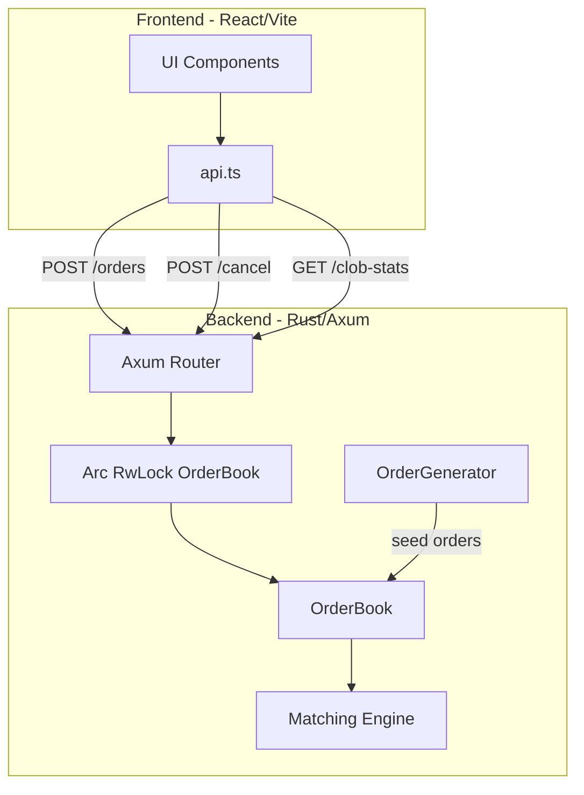
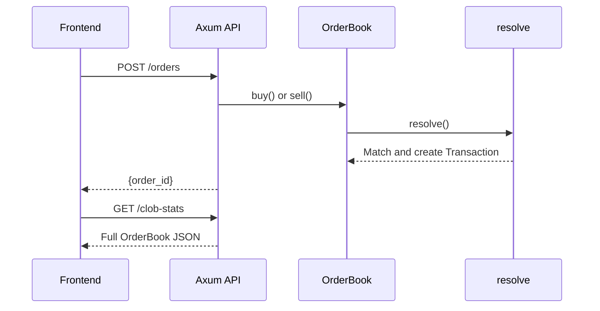

# CLOB MVP Architecture

Minimal Central Limit Order Book implementation with Rust backend and React frontend.

---

## Architecture Diagram



---

## Key Components

### 1. Core Data Structures ([`lib.rs`](backend/src/lib.rs))

| Struct | Fields | Purpose |
|--------|--------|---------|
| `Order` | `buy_order`, `price`, `quantity`, `id`, `time_created` | Single limit order |
| `OrderBook` | `buy_orders: BTreeMap<Price, Vec<Order>>`, `sell_orders: BTreeMap<Price, Vec<Order>>`, `transactions` | Price-sorted order storage |
| `Transaction` | `price`, `quantity`, `time` | Executed trade record |

### 2. Matching Engine (`resolve()`)

- **Price-time priority**: BTreeMap sorts by price; Vec preserves FIFO at each level
- **Match condition**: `highest_bid >= lowest_ask`
- **Partial fills**: Updates remaining quantity, removes fully filled orders
- **Auto-resolve**: Called after every `buy()` / `sell()`

### 3. API Layer ([`axum_bin.rs`](backend/src/bin/axum_bin.rs))

| Endpoint | Method | Payload | Response |
|----------|--------|---------|----------|
| `/` | GET | - | `"CLOB API Homepage"` |
| `/clob-stats` | GET | - | Full `OrderBook` JSON |
| `/orders` | POST | `{buy_order, price, quantity}` | `{status, order_id}` |
| `/cancel` | POST | `{order_id}` | `{status, order_id}` |

### 4. Order Generator ([`order_generator.rs`](backend/src/order_generator.rs))

Seeds 20 random orders at startup using configurable volatility around a center price (10.0).

---

## Data Flow



---

## Concurrency Model

- State wrapped in `Arc<RwLock<OrderBook>>`
- Read lock for `/clob-stats`
- Write lock for `/orders` and `/cancel`
- Single-threaded matching (no race conditions)

---

## File Structure

```
clob_mvp/
├── backend/
│   ├── src/
│   │   ├── lib.rs           # OrderBook, Order, Transaction, matching engine
│   │   ├── order_generator.rs # Random order seeding
│   │   └── bin/
│   │       └── axum_bin.rs  # HTTP API
│   └── Cargo.toml
└── frontend/clob-frontend/
    └── src/
        ├── api.ts           # createOrder(), cancelOrder()
        └── components/      # ClobStats, CreateOrderForm, CancelButton
```

---

## Running the System

### Backend
```bash
cd backend
cargo run --bin axum_bin
```
Server runs on `http://localhost:3000`

### Frontend
```bash
cd frontend/clob-frontend
pnpm dev
```
UI runs on `http://localhost:5173`

---

## Design Decisions

**BTreeMap for Price Levels**: O(log n) insertion and automatic price sorting. Buy orders descending (highest first), sell orders ascending (lowest first).

**Vec for Order Queue**: FIFO at each price level maintains time priority.

**Auto-Matching**: `resolve()` called synchronously after each order prevents stale state.

**Shared State**: `Arc<RwLock<>>` enables concurrent API requests while protecting matching engine invariants.
